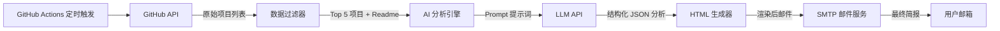

# GitHub Trending AI Daily（GitHub 趋势 AI 日报）PRD

| 字段 | 内容 |
|---|---|
| 项目名称 | GitHub Trending AI Daily (GitHub 趋势 AI 日报) |
| 版本 | v1.0 (MVP - 最小可行性产品) |
| 文档状态 | 草稿 |
| 最后更新 | 2026-01-29 |

## 1. 项目背景与目标 (Background & Goals)

### 1.1 背景
开发者每天面临海量的新开源项目信息。GitHub Trending 榜单虽然能反映热度，但缺乏深度筛选。用户没有时间逐个阅读 README 来判断项目是否有价值。

### 1.2 目标
构建一个全自动化的简报系统，每天从 GitHub 获取高潜力的热门项目，利用 LLM（大语言模型）进行深度摘要和分析，并以邮件形式推送给订阅者。

### 1.3 核心价值
- **节省时间**：每天只需 2 分钟即可了解 GitHub 最火的技术动态。
- **深度洞察**：不仅仅是标题，AI 会分析“这东西到底有什么用”。
- **被动接收**：邮件推送，无需主动刷网站，缓解信息焦虑。

## 2. 用户故事 (User Stories)
- 作为一名开发者，我希望每天早上收到一封邮件，这样我可以在通勤或开始工作前了解技术趋势。
- 作为一名开发者，我希望邮件里不仅有项目链接，还有中文的总结，因为我看长篇英文 README 比较累。
- 作为一名开发者，我希望能过滤掉我不感兴趣的语言（比如我只关注 Python/C++/Rust），或者至少在邮件中高亮显示。

## 3. 功能需求 (Functional Requirements)

### 3.1 模块一：数据获取 (Data Scraper)
- **F1.1 获取 Trending 列表**：系统需支持获取 GitHub 过去 24 小时内 Star 数增长最快的项目。
- **F1.2 基础过滤**：
  - 排除非技术类项目（如 free-programming-books、996.icu 等纯资源列表，可通过 Topic 或 Description 关键词过滤）。
  - MVP 阶段：每次获取 Top 5 - Top 10 的项目。
- **F1.3 元数据提取**：提取项目名称、URL、Star 总数、今日新增 Star 数、主要编程语言、README 原始内容。

### 3.2 模块二：AI 智能分析 (AI Analysis Engine)
- **F2.1 内容压缩**：将过长的 README 截断（Token Limit 保护），仅保留核心部分传给 LLM。
- **F2.2 结构化总结**：要求 AI 针对每个项目输出以下 JSON 字段：
  - `one_sentence_summary`：一句话介绍（中文）。
  - `core_features`：3 个核心功能点。
  - `tech_stack`：涉及的关键技术栈。
  - `use_case`：适合什么场景下使用。
  - `score`：AI 推荐指数（1-5 分）。

示例结构（字段名示意）：
```json
{
  "one_sentence_summary": "……",
  "core_features": ["……", "……", "……"],
  "tech_stack": ["……", "……"],
  "use_case": "……",
  "score": 5
}
```

### 3.3 模块三：报告生成与发送 (Report & Notification)
- **F3.1 HTML 模板渲染**：将 AI 分析结果渲染为美观的 HTML 邮件。  
  - 样式要求：极简风格，移动端适配。  
  - 包含元素：项目标题（带链接）、Star 数徽章、AI 总结卡片。
- **F3.2 邮件发送**：通过 SMTP 服务将生成的 HTML 发送给指定收件人列表。

### 3.4 模块四：任务调度 (Scheduler)
- **F4.1 定时执行**：北京时间每天早上 8:00 自动触发。
- **F4.2 错误重试**：如果 GitHub API 或 LLM API 调用失败，需支持简单的重试机制（如间隔 5 分钟重试 1 次）。

## 4. 非功能性需求 (Non-functional Requirements)
- **成本**：运行在 GitHub Actions 上（免费），使用 Gemini Pro API（免费层级）或 DeepSeek（低成本）。
- **稳定性**：需处理 GitHub API 的 Rate Limit（速率限制）。
- **安全性**：API Key 和邮箱密码必须通过 Environment Secrets 管理，严禁硬编码。

## 5. 技术架构 (Tech Stack)

| 类别 | 选择 |
|---|---|
| 编程语言 | Python 3.9+ |
| LLM 模型 | Google Gemini Pro 1.5 或 DeepSeek-V3 |
| 基础设施 | GitHub Actions (Cron Job) |
| 关键库 | `requests`（API 调用）；`google-generativeai` / `openai`（AI 交互）；`jinja2`（HTML 模板渲染）；`smtplib`（邮件发送） |

## 6. 数据流向图 (Data Flow)


## 7. 待办事项 (Roadmap / To-Do)

### Phase 1：MVP（本周目标）
- [ ] 编写 Python 脚本调用 GitHub Search API 获取昨日高星项目。
- [ ] 接入 Gemini/OpenAI API，跑通 README 总结流程。
- [ ] 编写简单的 HTML 邮件模板。
- [ ] 配置 GitHub Actions 实现自动运行。

### Phase 2：优化体验
- [ ] 增加 `config.yaml` 配置文件，支持自定义关注语言（如只看 C++ 或 Python）。
- [ ] 将发送历史归档保存为 Markdown 文件，推送到 GitHub 仓库作为静态博客。
- [ ] 增加 Telegram Bot 或 飞书/钉钉 Webhook 推送渠道。
